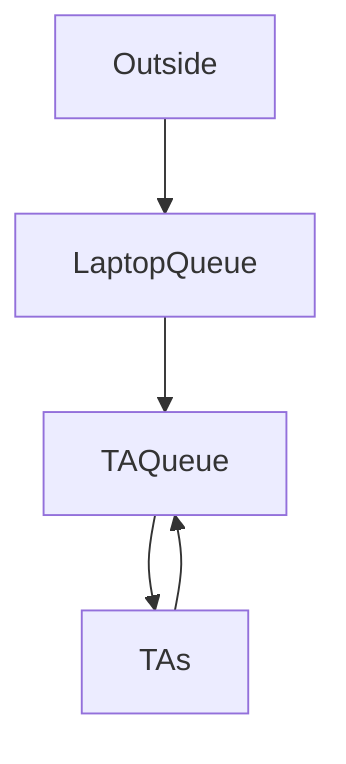

### Description

For each of the semester programs (each resulting in a 3 day simulation), print out a
header with the following format:
**********
Program X:
**********
Where X is the ith program of the semester. Follow this with a blank line. For each day
of the three-day simulation, print the following header: Day: where Day represents the
day of the simulation (“Monday”, “Tuesday”, or “Wednesday”).
Follow this with a blank line.
The following lines will give information about a TA beginning or ending their lab
hours, or a student either entering or leaving, picking up or returning a laptop, or
starting or finishing their session with a TA. These lines should be printed in the
order in which the actions occur.

### The formatting for these lines is as follows:
```text
TIME: TA_NAME has begun lab hours.
TIME: TA_NAME has finished lab hours.
TIME: There are no TAs on duty. Arslan is now closed.
TIME: STUDENT_NAME has arrived in Arslan.
TIME: STUDENT_NAME has borrowed laptop SERIAL and moved to the TA line.
TIME: STUDENT_NAME is getting help from TA_NAME.
TIME: STUDENT_NAME has had one question answered and gotten back in line.
TIME: STUDENT_NAME has no more questions and will now return the laptop.
TIME: STUDENT_NAME has returned laptop SERIAL and went home HAPPY.
TIME: STUDENT_NAME has returned laptop SERIAL and went home FRUSTRATED.
TIME: STUDENT_NAME never even got a laptop and went home FRUSTRATED.
TIME: STUDENT_NAME has had one question answered, but must now  
return the laptop and exit the lab.
```
where TIME is the time the Student checked in, STUDENT_NAME is the name of
the student (first name followed by a space and then followed by the last name),
TA_NAME is the name of the TA, and SERIAL is the serial number of a laptop.
A student is “happy” if all of their questions were answered, and is “frustrated”
otherwise. Students only go home happy if they had at least** 75%** of their questions
answered. Otherwise, they go home frustrated. So, if a student had 10
questions, but only 7 were answered, they would go home frustrated. But if that
student had 8 questions answered, they would go home happy.
The time should be printed out in the following format: (H)H:MM PM
The first one (or possibly two) digits represent the hour. The hour must not be
printed as 0 if it is between noon and 1:00, so you’ll need to check for this. This is
followed by a colon and then the next two digits represent the minute. If the
minute value is less than 10, you’ll need to add a leading 0, so that it prints as 3:05,
not 3:5. (It probably makes sense to have a function that takes in as input the
number of minutes after noon and in turn prints out the corresponding time in this
format.)

#### The following explanation covers the few cases 
Explanation of Output:
Most of the output is straightforward.
That may not be completely clear TIME: STUDENT_NAME is getting help from TA_NAME.
- This output should occur AS SOON AS the student begins working with the TA.
TIME: STUDENT_NAME never even got a laptop and went home FRUSTRATED.

- This output should occur if a student is in line, to GET a laptop (they came
REALLY late to the lab) and the lab closes before they even get a laptop.
TIME: STUDENT_NAME has had one question answered, but must now return
the laptop and exit the lab.
- This output occurs when a student is working with a TA, whose hours
have finished AND who is the last TA on duty (meaning the lab is now
closed). So when that student finishes with the TA, if they have had at least
75% of their questions answered, they go home happy. Otherwise, you need
the above output.
TIME: There are no TAs on duty. Arslan is now closed.

- This message should only print AFTER the last TA has finished their hours
AND AFTER their respective “TA_NAME has finished lab hours.” message
has printed.
- Output Day Summary:
	Follow each day’s output with one blank line. Then you will print that day’s lab
	summary as follows:
		Day’s Lab Summary:
		The TA Lab was open for H hours M minutes.
		Y students visited the lab. Out of those students, only Z left happy.
		The remaining left frustrated.
		Lesson Learned: do not procrastinate! Start programs early!
		where “Day’s” represents that day of the simulation (Monday’s, Tuesday’s, or
		Wednesday’s). The lab is open from when the first TA arrives until the last student
		leaves the lab (by returning their laptop. So, if the last TA finishes their office hours
		at 6:30 PM, works an extra 4 minutes with a student till, 6:34 PM, and if it then takes
		all the students till 6:42 PM to exit the lab, you would say that the lab is open for 6
		hours and 42 minutes
